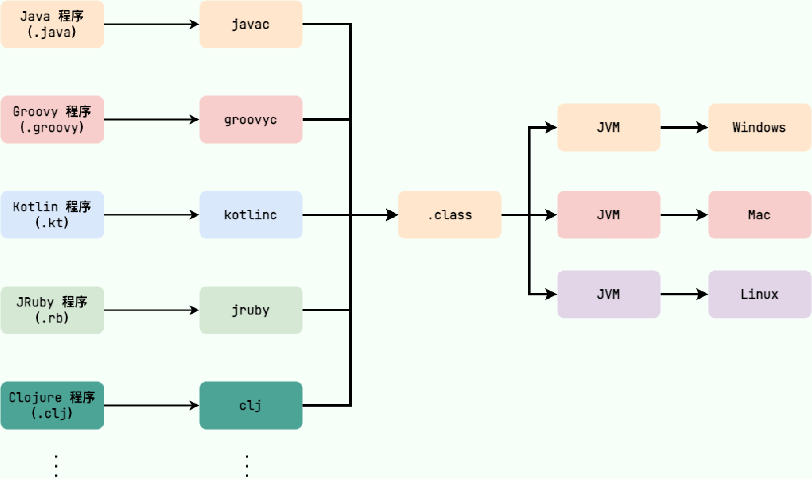
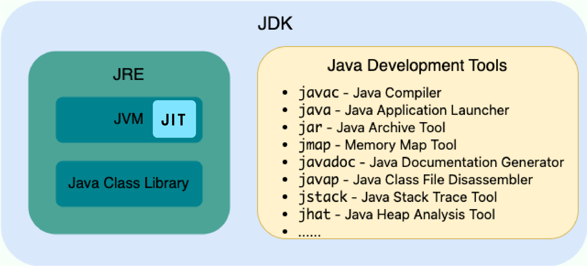
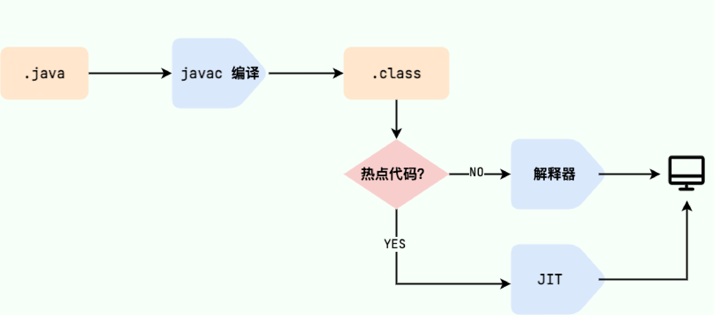
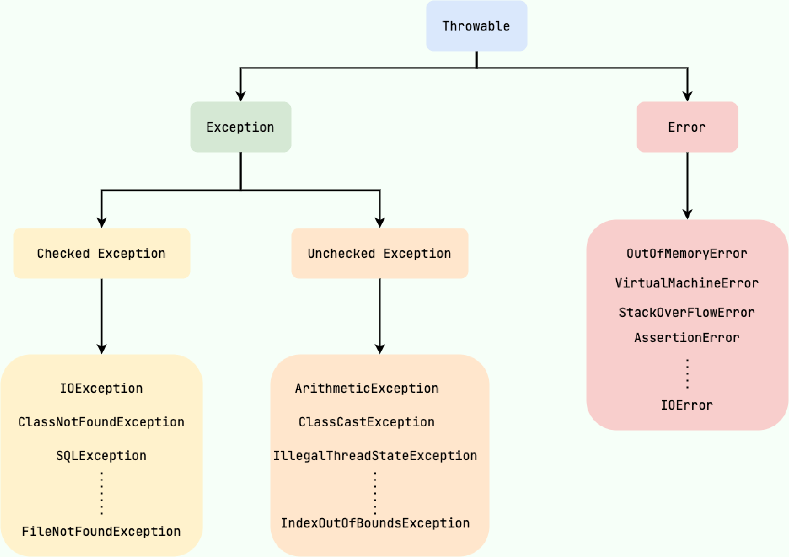
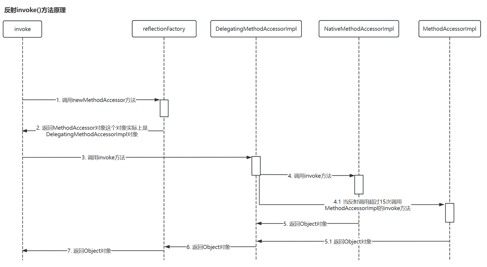
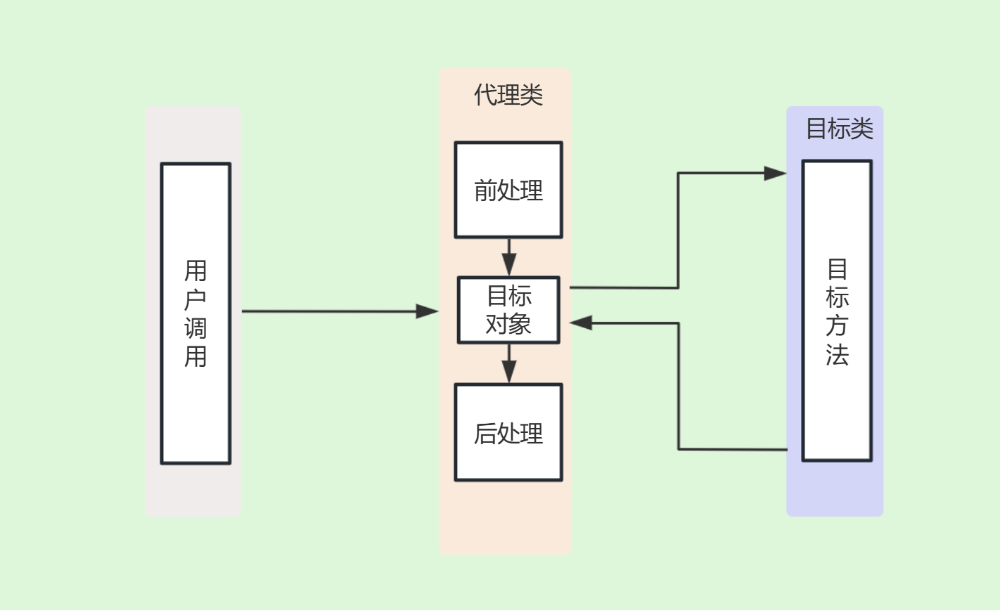
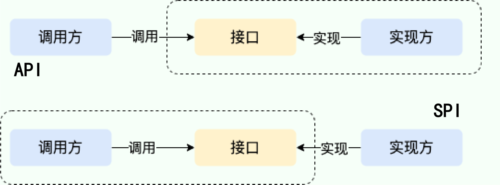
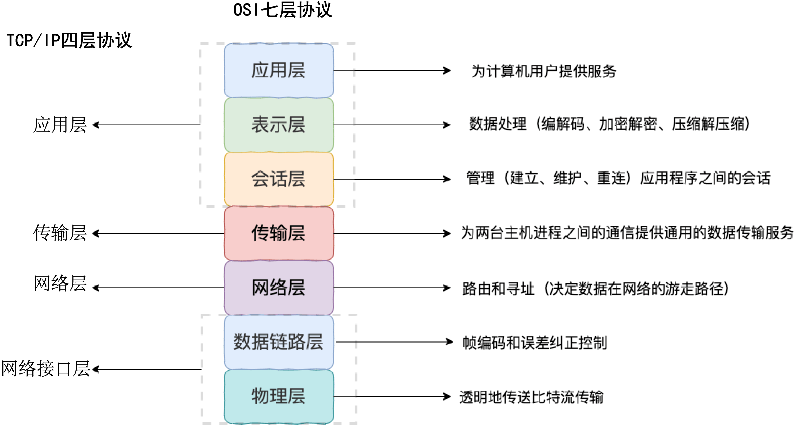
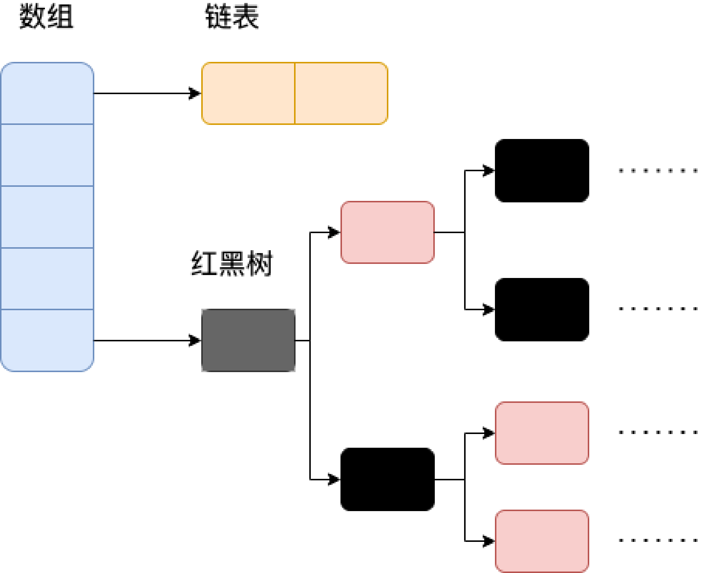

# Java笔记

## Java基础

### JVM

------

Java虚拟机是运行Java字节码的虚拟机。JVM通过对不同系统的特定实现，以达到：不同编译语言经过其各自编译器得到的字节码（.class文件），能通过JVM在不同系统上运行。



### JDK底层结构

------

JDK是Java开发工具包，用于创建和编译Java程序，其包含了Java运行环境JRE、编译器javac、调试器jdb等其他工具。

其中JRE作为运行Java程序所需环境，包含以下两个部分：

- JVM：Java虚拟机，包含JIT（及时编译）编译器。
- Java基础类库：一组标准的类库，提供常用的功能和API。



Java程序的运行过程是先有javac编译器编译成字节码，再由JVM的类加载器首先加载字节码，然后再通过解释其逐行解释执行，而对于其中的热点代码则是由JIT进行编译（动态编译）。当JIT编译器完成第一次编译后，其会将字节码对应的机器码保存下来，以供下次直接使用，以此提升运行速度。这也就是**Java实际上是编译与解释共存的语言**。



然而，由于Java程序是先解释执行字节码，再进行JIT编译优化的动态编译，*非常容易出现实际加载的代码要远多于实际需要运行的代码，造成了Java程序内存占用虚高的情况*。

为此，一种新的编译模式AOT（提前编译或静态编译，在程序被执行前就将其编译成机器码）在JDK 9中被提出，以此来解决Java占用内存虚高的问题。

相比于具备更高的极限处理能力的JIT而言，AOT更适合当下的云原生场景，对微服务架构支持更加友好，但却无法支持Java的动态特性，如反射、动态代理、动态加载等。因此，JIT与AOT各有适应的场景。

### JAVA基础语法

------

**移位运算**

Java中有三种移位运算符：

- `<<`：左移，整体向左移若干位，高位丢弃，低位补零。`x<<n`相当于x乘以$2^n$；
- `>>`：考虑符号位右移，整体向右移若干位，高位补符号位，低位丢弃。正数高位补0，负数高数位补1。相当于x除以$2^n$。
- `>>>`：不考虑符号位右移，整体向右移若干位，空位都以0补齐。相当于将数值当作无符号整数来处理。

*当移位位数超过数值所占有的位数时，会先求余再进行移位操作。即`x<<42`等同于`x<<10`*。

**基本数据类型与包装类型**

基本数据类型的存储位置取决于它们的作用域和声明方式。如果它们是局部变量，那么它们会存放在JVM栈的局部变量表中；如果它们是成员变量，那么它们会存放在JVM的堆/方法区/元空间中；

包装类型属于对象类型，几乎所有的对象实例都存储在堆中。

```java
public class Test {
    // 成员变量，存放在堆中
    int a = 10;
    // 被 static 修饰的成员变量，JDK 1.7 及之前位于方法区，1.8 后存放于元空间，均不存放于堆中。
    // 变量属于类，不属于对象。
    static int b = 20;

    public void method() {
        // 局部变量，存放在栈中
        int c = 30;
    }
}
```

Java 的包装类型的大部分都用到了缓存机制来提升性能。例如`Byte`，`Short`，`Integer`，`Long` 这 4 种包装类已经默认创建了**[-128,127]**范围内的缓存数据，这意味着 `Integer i1 = 40`是复用类中已经定义好的缓存中的对象，需要使用`new`才能创建新的对象。**因此，对于所有*整型包装类*间的比较必须使用`equals()`**。

- 自动装箱：将基本类型用其对应的引用类型包装起来，**实际上**就是调用了包装类的`valueOf()`方法，`Integer i = 10` 等价于 `Integer i = Integer.valueOf(10)`
- 自动拆箱：将包装类型转换为基本数据类型，**实际上**就是调用了`xxxValue()`方法，`int n = i` 等价于 `int n = i.intValue()`

**浮点数的精度**

对于浮点数由于无法用二进制准确表示，比如`0.2`，表示成二进制具有无限位数，就只能被截断，所以就会导致小数的精度发生损失。

对于需要浮点数精确运算的场景，则需要通过`BigDecimal`来处理，

在使用`BigDecimal`时，需要使用构造方法`BigDecimal(String val)`与静态方法`BigDecimal.valueOf(double val)`方法来构造对象。

```java
//创建对象
BigDecimal a=new  BigDecimal("1.0");
BigDecimal b=BigDecimal.valueOf(0.9);

//运算
System.out.println(a.add(b));
//divide(divisor,scale,roundingMode)
//scale是保留位数，roundingMode是保留规则，RoundingMode.HALF_UP是四舍五入
System.out.println(a.divide(b,2,RoundingMode.HALF_UP));

//比较大小使用compareTo，返回-1：a<b，0：a=b，1:a>b
//注意对于BigDecimal的比较也不能使用equals方法，因为equals方法会比较值的大小和精度，而compareTo的比较是忽略精度的
System.out.println(a.compareTo(b));

//setScale(scale,roundingMode)方法可用于设置精度
BigDecimal m=new BigDecimal("1.2345");
BigDecimal n=m.setScale(3,RoundingMode.HALF_UP);
```

**整型数据**

对于长度超过long的整型数据，需要用`BigInteger`来表示。`BigInteger` 内部使用 `int[]` 数组来存储任意大小的整形数据。

### 变量

------

对于局部变量，系统不会赋予默认值；但对于成员变量，系统会为其赋予初始值。

静态变量即被`static`关键字修饰的变量，可以被所有实例共享，无论创建多少个实例，静态变量只会被分配一次内存。

### 方法

------

**静态方法不能调用非静态成员变量**，因为静态方法是属于类的，在类加载时就会分配内存，而非静态成员变量是属于实例的，需要创建对象才会产生，因此如此调用属于非法操作。

**重载与重写的区别**：重载是同一个类中多个同名方法根据不同的传参方式来执行不同的逻辑操作；重写是子类对所继承的父类的方法进行重新实现，传参方式不能改变。

**方法的重写要遵循“两同两小一大”**：

- “两同”即方法名相同、形参列表相同；
- “两小”指的是子类方法返回值类型应比父类方法返回值类型更小或相等，子类方法声明抛出的异常类应比父类方法声明抛出的异常类更小或相等；
- “一大”指的是子类方法的访问权限应比父类方法的访问权限更大或相等。

**可变长参数方法**：可变长参数即传入方法的参数个数不定，*可变长参数需放在方法参数列表的最后一个。* **实际上**，可变参数编译后转换成一个参数数组。

```java
//其中传入test方法的String类型参数个数不定
public void test(String... args){
    //...
}
//对于类中的重载方法，优先匹配固定参数的方法。
public void test{
    public void test1(String... args){
    //...
	}
    
    //优先调用该方法
    public void test1(String arg1，String arg2){
    //...
	}
}
```

### 面向对象

------

**对象**：`String str=new String("hello")`创建了一个名为str的对象，其中`"hello"`为对象的实体，存放在堆内存中，而`str`则为对象的引用，存放在栈内存中。

*构造方法不能被重写，只能被重载。*

**接口与抽象类**：接口通常只能有方法声明，而抽象类中不做限制。一个类只能继承一个类，却可以实现多个接口。

**深拷贝、浅拷贝及引用拷贝**：深拷贝是完全复制整个对象，包括这个对象所包含的内部对象；浅拷贝会在堆上创建一个新的对象，然而，如果对象内部属性为引用类型的话，浅拷贝会直接复制内部对象地址的引用地址，即拷贝对象与原对象共用一个引用对象；引用拷贝则是两个不同的变量名指向同一个对象。


**hashCode**：`hashCode()`方法与`equals()`方法都是用于判断对象是否相等的。对于一些容器（HashMap，HashSet）而言，判断元素首先判断容器内是否有相同的hashCode，如果有，再使用equals方法判断比较对象与容器内的有相同hashCode的对象是否相等，这样可以大大提升查找效率。

对于对象而言，hashCode相等并不代表两个对象相等，因为哈希算法有可能存在哈希碰撞的情况，所以还需要使用`equals()`方法来判断。hashCode相等对象不一定相等，hashCode不等，对象一定不等。所以，**重写`equals()`方法时一定要重写`hashCode()`方法，否则会产生equals判断相等，hashCode判断不等的情况。**

### String对象

------

**String StringBuilder StringBuffer**

String对象是不可变的，可当作常量，是线程安全的。当使用`String str="hello"`的方式创建String对象时，JVM会在常量池中查找有没有已经存在的值和创建对象值相同，如果有就把它赋给当前引用；如果没有，就在常量池创建一个新的String对象；采用`String Str=new String("hello")`的方式创建时，对象会创建在**堆**中，同时还会调用`intern()`函数：如果该对象不在常量池中，也会在常量池中创建一个新的String对象。所以每次对String改变，**实际上**都是生成了新的String对象；

`StringBuffer`与`StringBuilder`都是可变的，区别在于`StringBuffer`加了同步锁，是线程安全的，`StringBuilder`没加同步锁，线程不安全，但运行性能强。

`String`类**实际上**是采用private final关键字定义的字符数组，类中没有提供修改该数组的方法，且由于被final修饰，不可被继承，因此，`String`对象是不可变的。


**字符串拼接**

对于`String str=str1+str2`包含字符串变量的拼接，**实际上**是创建了一个`StringBuilder`对象，再调用对象的`append()`函数进行拼接。因此，在循环中应尽量直接使用`StringBuilder`对象拼接而不是`+`，以避免反复创建`StringBuilder`对象。

对于`String str="str"+"ing"`的情况，javac编译器会在编译阶段进行**常量折叠**的优化，直接优化为`"String str=string"`，并不是所有的常量都会进行折叠，只有编译器在程序编译期可以确定值的常量才行，包括：

- 基本数据类型及字符串常量；
- `final`修饰的基本数据类型和字符串常量，`final`关键字修饰过的可直接当作常量看待；
- 字符串通过 “+”拼接得到的字符串、基本数据类型之间算数运算（加减乘除）、基本数据类型的位运算（<<、>>、>>> ）。

### 异常

------

**Throwable**

所有的异常类都有一个祖先`Throwable`类，该类下由两个子类：

- `Exception`：程序本身可以处理的异常，可以通过`catch`捕获。而`Exception`又分为：
  - `Checked Exception`：受检查异常，在编译过程中，如果受检查异常没有被catch或throws关键字处理的话，编译无法通过。除了`RuntimeException`及其子类，其它的`Exception`如Io相关异常，ClassNotFoundException等都属于受检查异常；
  - `Unchecked Exception`：不受检查异常，在编译过程中即使不处理，也可以正常通过编译，常见的包括：`NullPointerException`(空指针错误)，`ArrayIndexOutOfBoundsException`（数组越界错误），`ClassCastException`（类型转换错误）等。
- `Error`：程序无法处理的错误，不建议使用`catch`捕获，例如Java虚拟机错误、虚拟内存错误等，当发生这些异常时，JVM会选择线程终止。



Throwable类常用方法：

| 方法                         | 描述                                                         |
| ---------------------------- | ------------------------------------------------------------ |
| String getMessage()          | 返回异常发生时的详细信息                                     |
| String toString()            | 返回异常发生时的简要描述                                     |
| String getLocalizedMessage() | 返回异常对象的本地化信息，如果子类没有重写该方法，则返回内容与getMessage一致 |
| void printStackTrace()       | 在控制台打印Throw对象封装的异常信息                          |

**try-catch-finally**

无论是否捕获异常，finally块中的语句都会被执行，。当在try或catch中遇到return语句时，finally语句块会在方法返回之前被执行。

**注意：不要在finally语句和try/catch中同时使用return。**因为try和catch语句中的return返回值会先被暂存到一个本地变量中，当执行到finally中的return语句后，这个本地变量就变成了finally中的返回值。

当然，finally中的语句不一定总会执行，在以下三种情况下，finally语句也不会被执行：

- JVM被终止运行
- 程序所在的线程死亡
- 关闭CPU

### JAVA值传递

------

Java将实参传递给方法的方式是值传递（Java只有值传递）：

- 如果参数是基本数据类型，传递的就是基本类型数值的拷贝；
- 如果参数是引用类型，传递的**实际上**就是实参所引用**对象在堆中地址值的拷贝**。

### 泛型

------

泛型即“参数化类型”，包含三种使用方式：泛型类、泛型接口、泛型方法。

1. 泛型类：

```java
public class Generic<T>{
    private T key;
    public Generic(T key){
        this.key=key;
    } 
    public T getKey(){
        return key;
    }
}
//实例化
Generic<Integer> genericInteger = new Generic<Integer>(123);
```

2. 泛型接口：

```java
public interface Generator<T>{
    public T method();
}
//实现泛型接口，不指定类型
class GeneratorImpl<T> implements Generator<T>{
    @Override
    public T method(){
        return null;
    }
}
//实现泛型接口，指定类型
class GeneratorImpl implements Generator<String> {
    @Override
    public String method() {
        return "hello";
    }
}
```

3. 泛型方法：

```java
//在public与返回值之间的<E>必不可少，这表明这是一个泛型方法
public static <E> void printArray( E[] inputArray )
{
    for ( E element : inputArray ){
        System.out.printf( "%s ", element );
    }
    System.out.println();
}
//创建不同类型数组
Integer[] intArray = { 1, 2, 3 };
String[] stringArray = { "Hello", "World" };
printArray( intArray  );
printArray( stringArray  );
```

在java中泛型**实际上**只是一个占位符，也就是说只在编译阶段有效，必须在传递类型后才能使用。

**泛型通配符**

类型通配符一般使用`?`代替具体的类型实参，可以把其当作所有类型的父类。

```java
public void showKeyValue1(Generic<?> obj){
    Log.d("泛型测试","key value is " + obj.getKey());
}
Generic<Integer> gInteger = new Generic<Integer>(123);
Generic<Number> gNumber = new Generic<Number>(456);
```

**泛型边界**

通过`<? extends 父类型>`标识上边界通配符，用于表示实例化时可以确定父类型的未知类型，不能存，只能取；而`<? super 子类型>`标识下边界通配符，用于表示实例化时可以确定子类型的未知类型，可以存，取需要强制转型。

### 反射

------

正常情况下，Java假定在编译时就已经知道了一个对象的类型及信息，而反射就是在运行时才知道要操作的类是什么，并且可以在运行时获取类的完整构造并调用对应的方法。目前Spring，MyBatis等框架中大量使用了动态代理，而动态代理的实现就是依赖反射；另外Java中的注解的实现也用到了反射。

**反射基本流程**

```java
public class Apple {
    private int price;
    public int getPrice() {
        return price;
    }
    public void setPrice(int price) {
        this.price = price;
    }
    public static void main(String[] args) throws Exception{
        //正常的调用
        Apple apple = new Apple();
        apple.setPrice(5);
        System.out.println("Apple Price:" + apple.getPrice());
        //使用反射获取一个Apple对象
        //1.获取Apple类的Class对象实例
        Class clz = Class.forName("com.test.Apple");
        //2.根据Class对象实例获取Constructor对象
        Constructor appleConstructor = clz.getConstructor();
        //3.使用Constructor对象的newInstance方法获取反射类对象
        Object appleObj = appleConstructor.newInstance();
        //调用反射类对象的方法
        //1.获取方法的Method对象，其中需要指定方法所需参数的class
        Method setPriceMethod = clz.getMethod("setPrice", int.class);
        //2.利用invoke方法调用方法
        setPriceMethod.invoke(appleObj, 14);
        
        Method getPriceMethod = clz.getMethod("getPrice");
        System.out.println("Apple Price:"+getPriceMethod.invoke(appleObj));
    }
}
```

除上述过程外，还有一些反射类中常用的API：

- **获取Class实例**

	1. 使用`Class.forName`静态方法

```java
Class clz=Class.forName("com.test.Apple");
```

	2. 使用.class属性

```java
Class clz=Apple.class;
```

	3. 使用类对象的`getClass()`方法

```java
Apple apple=new Apple();
Class clz=apple.getClass();
```

- **创建类对象**

	1. 通过Class对象的newInstance方法，只能使用默认的无参构造方法创建反射类对象；

```java
Class clz=Apple.class;
Apple apple=(Apple) clz.newInstance();
```

	2. 通过Constructor对象的newInstance方法，可以选择使用构造方法；

```java
Class clz = Apple.class;
Constructor constructor = clz.getConstructor();
Apple apple = (Apple)constructor.newInstance();
```

- **获取类属性、方法、构造器**

使用`getFields()`方法可以获取Class类的属性，但无法访问私有属性。使用`getDeclaredFields()`方法则可获取包括私有属性在内的所有属性，其他方法及构造器同理。

```java
Class clz=Apple.class;
//getFields方法
Field[] fields=clz.getFields();
//getDeclaredFileds方法
Field[] fields1=clz.getDeclaredFields();
//获取Class类的属性
for (Field field:fields){
    System.out.println(field.getName());
}
```

反射中invoke方法的底层原理中，`DelegatingMethodAccessorImpl`调用的invoke方法有两个版本，在第一次加载时使用的是`NativeMethodAccessorImpl `的实现， 因为该对象的在一开始启动快，但随着运行时间变长，速度变慢；当反射调用次数超过15次后，则调用`MethodAccessorImpl `对象实现反射，该对象一开始加载慢，但随着时间变长速度变快。



### 代理模式

------

代理模式**实际上**就是使用代理对象来代替对真实对象的访问，这样就可以在不修改目标对象的前提下，进行额外的功能操作。代理模式的主要功能就是扩展目标对象的功能，比如在目标对象的某个方法执行前后增加一些自定义的操作。代理模式分为静态代理与动态代理两种。

**静态代理**

在静态代理中，对目标对象的每个方法的增强都是手动完成的。在JVM层面上，静态代理在编译时，就将接口、实现类、代理类变成一个个实际的class文件。

静态代理的实现：

```java
//1.定义一个接口及其实现类
//创建接口
public interface SmsService {
    String send(String message);
}
//实现类
public class SmsServiceImpl implements SmsService {
    public String send(String message) {
        System.out.println("send message:" + message);
        return message;
    }
}
//2.创建一个代理类同样实现该接口
public class SmsProxy implements SmsService {

    private final SmsService smsService;

    public SmsProxy(SmsService smsService) {
        this.smsService = smsService;
    }
    @Override
    public String send(String message) {
        //调用方法之前，添加自己的操作
        System.out.println("before method send()");
        smsService.send(message);
        //调用方法之后，添加自己的操作
        System.out.println("after method send()");
        return null;
    }
}
//3.将目标对象注入代理类，然后在代理类的对应方法调用目标类中的对应方法
public class Main {
    public static void main(String[] args) {
        SmsService smsService = new SmsServiceImpl();
        SmsProxy smsProxy = new SmsProxy(smsService);
        smsProxy.send("java");
    }
}
```



**动态代理**

动态代理不需要针对每个目标类创建代理类，也无需实现接口，可以直接代理实现类。在JVM层面，动态代理是在运行时动态生成类字节码，并加载到JVM中的。Spring中的AOP的实现就依赖了动态代理。

**JDK动态代理机制**

JDK动态代理的使用步骤：

1. 定义一个接口及其实现类；
2. 定义一个`InvocationHandler`接口的实现类，重写`invoke`方法，在其中调用被代理类的方法，并增加自定义的处理逻辑；
3. 使用`Proxy.newProxyInstance(Classloader loader,Class<?>[] interfaces,InvocationHandler h)`方法创建代理对象。

```java
//定义接口及实现类
// . . .
//定义InvocationHandler实现类
public class DebugInvocationHandler implements InvocationHandler{
    //代理类中真实的对象
    private final Object target;
    public DebugInvocationHandler(Object target){
        this.target=target;
    }
    @Override
    public Object invoke (Object proxy, Method method,Object[] args) throws InvocationTargetException, IllegalAccessException{
        //前处理
        processBefore();
        //调用真实方法
        Object result=method.invoke(target,args);
        //后处理
        processAfter();
        
        return result;
    }
}
//创建工厂类来获取代理对象
public class JdkProxyFactory{
    public static Object getProxy(Object target){
        return Proxy.newProxyInstance(
            target.getClass().getClassLoader(),//目标类的类加载器
            target.getClass().getClassInterfaces(),//代理需要实现的接口
            new DebugInvocationHandler(target)//代理对象对应的自定义InvocationHandler
        );
    }
}
//生成代理对象
Smsservice smsService=(SmsService) JdkProxyFactory.getProxy(new SmsServiceImpl());
smsService.send("java");
```

当代理对象调用原生方法时，实际上是调用的代理类中的`invoke()`方法，在`invoke()`中再调用被代理对象的原生方法。

**CGLIB动态代理机制**

JDK动态代理中只能代理实现了接口的类，为解决这个问题，可使用CGLIB动态代理机制。

CGLIB动态代理使用步骤

1. 定义一个类；
2. 自定义`MethodInterceptor`并重写`intercept`方法，`intercept`用于拦截增强被代理类的方法，类似于`invoke`。
3. 通过`Enhancer`类的`create()`创建代理类。

```java
//定义一个类
public class AliSmsService {
    public String send(String message) {
        System.out.println("send message:" + message);
        return message;
    }
}
//自定义MethodInterceptor
public class DebugMethodInterceptor implements MethodInterceptor{
    /**
     * @param o           被代理的对象（需要增强的对象）
     * @param method      被拦截的方法（需要增强的方法）
     * @param args        方法参数
     * @param methodProxy 用于调用原始方法
     */
    @Override
    public Object intercept(Object o, Method method, Object[] args, MethodProxy methodProxy) throws Throwable{
        //前处理
        processBefore();
        
        Object object =methodProxy.invokeSuper(o,args);
        
        //后处理
        processAfter();
        return object;
    }
}
//获取代理类
public class CglibProxyFactory {

    public static Object getProxy(Class<?> clazz) {
        // 创建动态代理增强类
        Enhancer enhancer = new Enhancer();
        // 设置类加载器
        enhancer.setClassLoader(clazz.getClassLoader());
        // 设置被代理类
        enhancer.setSuperclass(clazz);
        // 设置方法拦截器
        enhancer.setCallback(new DebugMethodInterceptor());
        // 创建代理类
        return enhancer.create();
    }
}
//生成代理对象
AliSmsService aliSmsService=(AliSmsService) CglibProxyFactory.getProxy(AliSmsService.class);
aliSmsService.send("java");
```

### 注解

------

注解可以看作是特殊的注释，主要用于修饰类、方法或变量，提供某些信息供程序在编译或运行时使用。注解**实际上**是一个继承了`Annotation`的特殊接口。

注解只有被解析之后才会生效，常见的解析方式有：

- 编译期直接扫描：编译器在编译Java代码时扫描对应的注解并处理；
- 运行期通过反射处理：像框架中自带的注解（如spring的@Value）都是通过反射来处理的。

### SPI

与API对应，是供服务提供或框架扩展使用的接口。当实现方提供了接口与实现，通过调用拥有实现方提供的能力，这就是**API**；而有调用方确定规则，不同的实现方根据规则实现服务，这个就是**SPI**。



SPI 机制的关键在于`ServiceLoader`类，具体实现**实际上**还是通过反射完成的。即：**按照规定将要暴露对外使用的具体实现类在 `META-INF/services/` 文件下声明，再通过反射创建接口的每一个实例对象，最后将构造的实例对象列表返回。**

### 序列化与反序列化

------

序列化就是将数据结构及对象转换成可以存储或传输的形式，而反序列化就是将转换成原始数据结构或对象的过程。序列化的主要目的是通过网络传输对象或将对象存储到文件系统、数据库、内存中。

序列化协议属于TCP/IP四层模型中的应用层协议：



JDK自带的序列化方式一般不会用，因为序列化效率低且存在安全问题。常见可用的有Hessian、Kryo、Protobuf、ProtoStuff等这些都是基于二进制的序列化协议，而JSON与XML输出文本类序列化方式，性能较差。

对于不想序列化的字段，可以使用`transient`关键字修饰，组织该变量序列化；反序列化时，被`transient`修饰的变量也不会被持久化和恢复。另外：

- `transient`只能修饰变量，不能修饰类和方法；
- `transient`修饰的变量，反序列化后，变量值会被置为默认值；
- `static`变量因为不属于任何对象，所以无论加不加`transient`始终不会被序列化。

### 语法糖

------

语法糖是编程语言为了方便程序开发而设计的特殊语法，这种语法往往更加简单易读。**实际上**是Java编译器能在编译过程将语法糖编译成基本语法，而非JVM能够支持语法糖。

Java中常见的语法糖有泛型、自动拆装箱、变长参数、枚举、内部类、增强for循环、try-with-resources语法、lambda表达式等。

## 集合

### 集合概览

------

Java集合，也叫做容器，主要是由两大接口派生而来：一个是`Collection`接口，用于存放单一元素，包含三个子接口`List`、`Set`、`Queue`；另一个是`Map`接口，用于存放键值对。


<font size="4">**List：**</font>存取有序，可以存放重复的元素，用下标对元素进行操作。

- **ArrayList：**内部基于动态数组实现，可以动态扩容，线程不安全；由于实现了`RandomAccess`接口，支持随机存取。
- **LinkedList：**使用方式与ArrayList相同，基于双向列表实现，不保证线程安全，不支持随机存取。
- **\*Vector：**相较于ArrayList实现了线程安全，性能更低，不建议使用。
- **\*Stack：**Vector的子类，多增加了pop（弹出栈顶元素）与push（元素入栈）等与堆栈相关的方法，线程安全也不建议使用。

<font size="4">**Set：**</font>存取无序，不能存放重复元素，不可以用下标操作。

- **HashSet：**底层实际上是由HashMap实现的，只是值采用的是固定的Object对象，主要用于去重。
- **LinkedHashSet：**继承自HashSet，底层由LinkedHashMap实现。与HashSet不同，能够维护元素的插入顺序。
- **TreeSet：**基于红黑树实现的有序集合，底层基于TressMap实现，可以按照键的自然顺序后指定的顺序自动对集合中的元素进行排序。

<font size="4">**Queue：**</font>遵循先进先出原则，将新元素插入到队列末尾，访问元素返回队列头部。

- **ArrayDeque：**基于数组实现的双端队列，数组的任意一点都能被看作起点或终点，不能存储null。
- **LinkedList：**实现了Deque接口，也可作为队列使用。
- **PriorityQueue：**是一种优先级队列，弹出顺序与元素的优先级有关，总是返回优先级最高的元素，而优先级的确定，就需要实现Comparable接口或Comparator接口。非线程安全，不可存储null。
- **\*BlockingQueue：**阻塞队列，是一个接口继承自Queue。其支持当队列没有元素时一直阻塞直到有元素加入，如果队列已满，需等到队列有空闲位置才能放入新元素。常用于生产者-消费者模型中。

<font size="4">**Map：**</font>字典，保存键值对。

- **HashMap：**实现了Map接口，可以通过哈希函数将键快速地映射到哈希表中的索引位置，实现快速访问。
  - HashMap中的键和值都可以是null，如果键为 null，则将该键映射到哈希表的第一个位置。
  - HashMap有一个初始容量和负载因子，初始容量是指哈希表的初始大小，负载因子是指哈希表在扩容之前可以存储的键值对数量与哈希表大小的比率。默认初始容量是16，负载因子是0.75。
  - HashMap默认每次容量扩充变为原来的2倍，如果指定容量初始值，则初始容量会设置为$2^n$。至于为什么是$2^n$，主要是因为，1）HashMap底层是根据hash值对数组大小取余来确定元素在数组中的位置的（即index索引），而对于取余操作而言，如果除数是2的指数次方，取余操作可等价为同除数减一进行与操作即`hash%length=hash&(length-1)`，采用位运算能显著提高效率。2）长度是2的指数，可以让HashMap在扩容时更均匀，即可以使得原来数组中元素的位置要么在新数组的前半部分，要么在新数组的后半部分。3）使得扩容机制变得简单高效，只需要根据哈希值的高位元素即可判断（0则位置不变，1则移动到源索引值加上原容量的新位置）
  - HashMap线程不安全，可能会导致数据覆盖的风险，因此在多线程下应该避免使用HashMap而使用`ConcurrentHashMap`。



- **\*HashTable：**与HashMap作用相同，但线程安全，不支持存储null值，默认初始大小为11，默认情况下每次扩充容量变为原来的2n+1，如果指定了容量初始值，则直接使用给定的大小。与`ConcurrentHashMap`的区别在于实现线程安全的方式不一样：`ConcurrentHashMap`底层采用Node数组+链表/红黑树（当链表长度过长，转成红黑树）的结构，并发控制使用`synchronized`和CAS来操作。`HashTable`底层采用数据+链表的形式，只采用`synchronized`保证线程安全，效率低下，不建议使用。
- **LinkedHashMap：**LinkedHashMap是HashMap的子类，可看作HashMap+LinkedList，使用哈希表存储数据又使用链表来记录插入/访问元素的顺序。
- **TreeMap：**实现了SortedMap接口，内部使用红黑树来实现自动将键按自然顺序或指定比较器顺序来排序，搜索操作的时间复杂度为$O(log_n)$。

**Comparator与Comparable**

Comparable接口内部只有一个方法`int compareTo(T t)`，而Comparator接口内部有两个方法`int compare(T o1, T o2);boolean equals(Object obj)`用户只需要实现compare。由于compareTo方法只接受一个对象参数，因此实现Comparable接口的类相当于是定义了一个类内部的方法去比较，而Comparator接口的compare方法接受两个对象参数，就相当于使用了一个第三方的比较器去比较两个对象，同时也可以基于不同的比较规则创建不同的比较器，相比于Comparable更加灵活。

**Iterator与Iterable**

Iterator是Java中的迭代器对象，是对List这样的集合进行迭代遍历的底层依赖。而Iterable接口中定义了返回Iterator的方法，是对Iterable的封装，只有实现了Iterable接口才能支持for each循环。

```java
//Iterator接口
public interface Iterator<E>{
    boolean hasNext();
    E next();
}
//支持for each遍历的集合类中都实现了Iterable接口，目的主要是返回一个Iterator对象
public interface Iterable<T> {
  Iterator<T> iterator();
}
//例如List
Iterator iterator = list.iterator();
while(iterator.hasNext()){
    System.out.println(iterator.next());
}
//或者采用for each方式遍历，本质上还是使用的iterator对象，这是个语法糖
while(Integer i : list){
    System.out.println(iterator.next());
}
```

将Iterator与Iterable分开的原因是有些集合类可能不止一种遍历方式，实现了Iterable类后还要实现多个Itertor类。

### ArrayList

------

**扩容**

以`add(E e)`方法为例，解释ArrayList的扩容机制。`add`方法内部首先调用了`ensureCapacityInternal`方法来确认数组空间足够，再向数组中增加元素。

```java
public boolean add(E e){
    //确保数组容量足够
    ensureCapacityInternal(size+1);
    elementData[size++]=e;
    return ture;
}
```

在`ensureCapacityInternal`内部，判断了当前数组是否为初始数组，如果为初始数组的话，则需将数组进行初始化，扩容到10，再调用 `ensureExplicitCapacity()` 方法确保数组容量足够。

```java
private void ensureCapacityInternal(int minCapacity){
    //DEFAULTCAPACITY_EMPTY_ELEMENTDATA即为初始数组{}
    if(elementData == DEFAULTCAPACITY_EMPTY_ELEMENTDATA){
        //DEFAULT_CAPACITY=10
    	minCapacity = Math.max(DEFAULT_CAPACITY,minCapacity);
    }
    ensureExplicitCapacity(minCapacity);
}
```

在`ensureExplicitCapacity`中首先检查了minCapacity是否超出了数组范围，确保不会溢出，如果过确实超出范围，则调用`grow`函数进行扩容。

```java
private void ensureExplicitCapacity(int minCapacity){
    if (minCapacity-elementData.length>0)
        grow(minCapacity);
}
```

`grow`函数要先确定新数组的大小，首先设置到原来的1.5倍，如果还是小于minCapacity，则将新数组直接设置为minCapacity，当然还要判断新数组大小是否超过数组可设置的最大值。最后调用`Arrays.copyOf()`函数，将原数组复制到新数组当中。

```java
private void grow(int minCapacity) {
    // 检查是否会导致溢出，oldCapacity 为当前数组长度
    int oldCapacity = elementData.length;
    int newCapacity = oldCapacity + (oldCapacity >> 1); // 扩容至原来的1.5倍
    if (newCapacity - minCapacity < 0) // 如果还是小于指定容量的最小值
        newCapacity = minCapacity; // 直接扩容至指定容量的最小值
    if (newCapacity - MAX_ARRAY_SIZE > 0) // 如果超出了数组的最大长度
        newCapacity = hugeCapacity(minCapacity); // 扩容至数组的最大长度
    // 将当前数组复制到一个长度为newCapacity的新数组中
    elementData = Arrays.copyOf(elementData, newCapacity);
}
```

**System.arraycopy**

```java
//elementData为源数组
//index为源数组中要复制的起始位置
//newElementData为要复制到的目标数组
//newIndex为目标数组中要复制到的起始位置
//size为源数组从起始位置开始要复制的元素的个数
System.arraycopy(elementData, index, newElementData, newIndex, size);
```

`System.arraycopy`函数十分重要，包括上述扩容中使用的`Arrays.copyOf`函数及`ArrayList`的`add`、`remove`在内，诸多函数的实现都是依赖于`System.arraycopy`。

### LinkedList

------

`LinkedList`的底层实现是双向链表，每一个元素是通过`Node`定义的：

```java
private static class Node<E> {
    E item;
    Node<E> next;
    Node<E> prev;
   
    Node(Node<E> prev, E element, Node<E> next) {
        this.item = element;
        this.next = next;
        this.prev = prev;
    }
}
```

`LinkedList`的容量理论上可以无限增加。

### HashMap

------

HashMap用于存放键值对，基于哈希表实现，非线程安全。可以存放null的key和value。

在JDK1.8之前，HashMap是由数组+链表（链表散列）组成的，数组作为HashMap的主体，链表用于解决哈希冲突（拉链法）。而在JDK1.8之后，增加了一些改变，当链表长度大于等于阈值（默认为8），进行判断当前数组的大小是否小于64，如果小的话，对数组进行扩容，否则，将链表转化为红黑树，以此减少搜索时间。

**hash方法**

hash方法的作用是将键的hashCode进行处理，以尽量避免哈希冲突的情况。

```java
//hash方法将键的hashCode的高位信息与低位信息混合得到新的哈希值，目的是增加随机性，让数据元素更加均衡的分布，减少碰撞。
static final int hash(Object key) {
    int h;
    return (key == null) ? 0 : (h = key.hashCode()) ^ (h >>> 16);
}
```

```java
//对新的哈希值取模运算就能得到一个实际存储位置。
int index = (n - 1) & hash;
```

在HashMap中每一个hash值映射到一个桶（Bucket）上，每个桶中存储着一个链表（或红黑树），每个节点存储着键值对。

### LinkedHashMap

------

可用于实现LRU（最近最少使用）缓存，与HashMap的不同在于是按插入顺序存储键值对，因为内部追加了双向链表，来维护元素的插入顺序。

### TreeMap

------

红黑树不同于HashMap与LinkedHashMap，可以保持元素按键的自然顺序或自定义顺序存储。

| 特性     | TreeMap        | HashMap        | LinkedHashMap    |
| -------- | -------------- | -------------- | ---------------- |
| 排序     | 支持           | 不支持         | 不支持           |
| 插入顺序 | 不保证         | 不保证         | 保证             |
| 查找效率 | O(log n)       | O(1)           | O(1)             |
| 空间占用 | 通常较大       | 通常较小       | 通常较大         |
| 适用场景 | 需要排序的场景 | 无需排序的场景 | 需要保持插入顺序 |

## 并发编程

