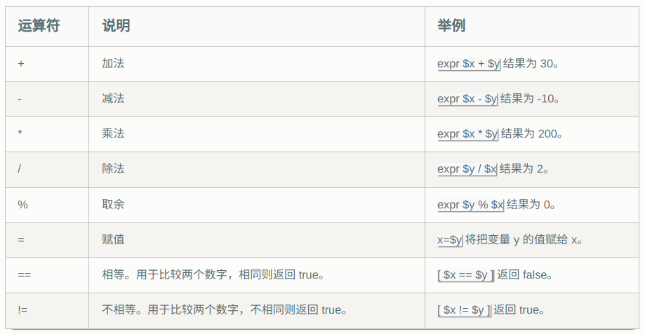
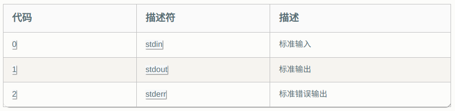
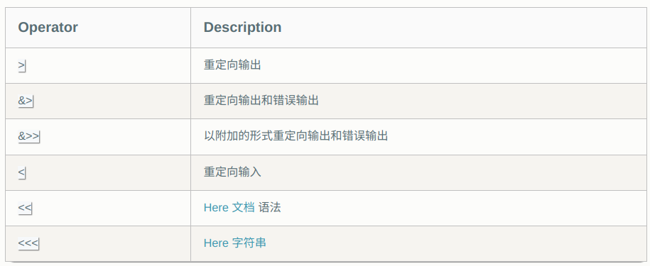

## Shell语言

原链接：https://zhuanlan.zhihu.com/p/264346586

### 变量

#### 变量类型

运行shell时，会同时存在三种变量：

- 局部变量：局部变量在脚本或命令中定义，仅在当前shell势力中有效；
- 环境变量：所有的程序都能访问；
- shell变量：shell变量是由shell程序设置的特殊变量。其中有一部分是环境变量，一部分是局部变量。

#### 变量操作

创建普通变量：name="test" (=两边不能有空格)

创建只能函数体中使用的局部变量：local name="test"

使用变量${name}

只读变量：name="only_read" ->readonly name

删除变量：unset name

#### 字符串变量

1. 单引号
   - 单引号变量var='test'，只能原样输出，变量无效
   - 单引号中出现一个单独的单引号，转义也不行
2. 双引号
   - 双引号变量var="my name is ${name}"，变量有效
   - 可出现转义字符
3. 拼接字符串
   - 中间无+，等字符
   - name="this is"" my name";name="this is my name";name="this" is "my name"等效
   - name='this is'' my name';name='this is my name';name='this' is 'my name'等效
4. 获取字符串长度
   - 在${}中使用“#”获取长度
   - name="test"
   - echo${#name}#输出为4
5. 提取子字符串
   - 1：4代表从第二个开始往后截取四个
   - ::4从第一个字符开始截取四个字符

当局部变量和环境变量包含空格时，它们在引号中的扩展要格外注意。

```shell
INPUT="A string  with   strange    whitespace."
echo $INPUT   ### A string with strange whitespace.
echo "$INPUT" ### A string  with   strange    whitespace.
```

**调用第一个`echo`时给了它 5 个单独的参数** —— `$INPUT` 被分成了单独的词，`echo`在每个词之间打印了一个空格。**第二种情况，调用`echo`时只给了它一个参数**（整个$INPUT 的值，包括其中的空格）。

#### 数组

bash只支持一维数组，不支持多维。

定义数组：array=(li wang xiang)小括号作边界、使用空格分离；

单独定义数组的元素或赋值：array[0]="w";

- echo ${array[@]}输出数组中的所有元素。
- 获得元素的个数：\${#array[@]}或\${#array}
- 获得单个元素的长度：${#array[1]}

参数传递

​	获取参数值：

- $0：代表执行的文件名
- $1：代表第一个参数
- $#：参数个数
- \$*：以一个字符串显示所有向脚本传递的参数"\$1 \$2 \$3..."
- \$@：与\$*类似，但是在引用时加引号，并在引号中返回每个参数
- $?：函数返回值

### 运算符

#### 算术运算符

+、-、*、\、%、=：乘号前必须加\转义才可以进行乘法运算

加法运算：

- val=\`expr 2+2\`(使用expr进行辅助运算)
- val=\$[2+2] (不同于条件判断，不必要有空格)
- val=$((2+2))



#### 数字关系运算符

**关系运算符只支持数字，不支持字符串，除非字符串的值是数字**

假定变量a=10，b=20

- -eq：检测两个数是否相等，相等返回true。[ \$a -eq \$b ] 返回false
- -ne：检测两个数是否不相等，不相等返回true。[ \$a -eq \$b ] 返回true
- -gt：检测左边的数是否大于右边的，是返回true，[ \$a -gt \$b ] 返回false
- -lt：检测左边的数是否小于右边的，是返回true，[ \$a -lt \$b ] 返回true
- -ge：检测左边的数是否大于等于右边的，是返回true，[ \$a -ge \$b ] 返回false
- -le：检测左边的数是否小于等于右边的，是返回true，[ \$a -le \$b ] 返回true

#### 字符串运算符

假定a="abc"，b="efg"

- =：检测两个字符串是否相等，相等返回true，[ \$a = \$b ]返回false
- ！=：检测两个字符串是否不等，不等则返回true，[ \$a = \$b ]返回true
- -z：检测字符串长度是否为0，为0则返回true，[ -z $a ]返回false
- -n：检测字符串长度是否不为0，不为0则返回true，[ -n $a ]返回true
- \$：检测字符串是否为空，不为空则返回true，[ $a ]返回true

#### 布尔运算符

假设a=10，b=20

- ！：非运算，[ ! false ]返回true
- -o：或运算，[ \$a -lt 20 -o \$b -gt 100 ]返回true
- -a：与运算，[ \$a -lt 20 -a \$b -gt 100 ]返回false

#### 逻辑运算符

假设a=10，b=20

- &&：逻辑的 AND [[ \$a -lt 100 && \$b -gt 100 ]] 返回 false
- || ：逻辑的 OR [[ \$a -lt 100 || \$b -gt 100 ]] 返回 true

#### 文件运算符

- -r file ：检测文件是否可读，如果是，则返回 true。 [ -r $file ] 返回 true。
- -w file ：检测文件是否可写，如果是，则返回 true。 [ -w $file ] 返回 true。
- -x file ：检测文件是否可执行，如果是，则返回 true。 [ -x $file ] 返回 true。
- -s file ：检测文件是否不为空（文件大小是否大于0），不为空返回 true。 [ -s $file ] 返回 true。
- -e file ：检测文件（包括目录）是否存在，如果是，则返回 true。 [ -e $file ] 返回 true。

#### 命令替换

命令替换与变量替换差不多，都是用来重组命令行的，先完成引号里的命令行，然后将其结果替换出来，再重组成新的命令行。

```shell
#使用反引号
`ls /etc`
```

#### 算术运算

1. \$[]：加减乘除，不必添加空格
2. $(())：加减乘除等，不必添加空格

在算数表达式中，使用变量无需带上`$`前缀：

```shell
x=4
y=7
echo $(( x + y ))     ### 11
echo $(( ++x + y++ )) ### 12
echo $(( x + y ))     ### 13
```

#### 逻辑判断

1. [ ] ： 中括号旁边和运算符两边必须添加空格 （可以使用，不推荐）
2. [[ ]]：中括号旁边和运算符两边必须添加空格 （字符串验证时，推荐使用）
3. (()) ： 中括号旁边和运算符两边必须添加空格 （数字验证时，推荐使用）
4. [[]] 和 (()) 分别是[ ]的针对数学比较表达式和字符串表达式的加强版。
5. 使用[[ ... ]]条件判断结构，而不是[ ... ]，能够防止脚本中的许多逻辑错误。比如，&&、||、<和> 操作符能够正常存在于[[ ]]条件判断结构中，但是如果出现在[ ]结构中的话，会报错。比如可以直接使用if [[ \$a != 1 && \$a != 2 ]], 如果不适用双括号, 则为if [ \$a -ne 1] && [ $a != 2 ]或者if [ \$a -ne 1 -a \$a != 2 ]。

#### 输出

##### echo

仅用于字符串的输出，没有使用printf作为输出的移植性好，建议使用printf

##### printf

```shell
printf "%-10s %-8s %-4.2f\n" 郭靖 男 66.1234
```

- %s %c %d %f 都是格式替代符
- %-10s ： 指一个宽度为10个字符（-表示左对齐，没有则表示右对齐）
- %-4.2f ：指格式化为小数，宽度为4个字符，其中.2指保留2位小数

### 流程控制

#### 条件语句

**if语句**：

```shell
if [[ "abc" -eq "abc" ]]
then
  echo ""abc" -eq "abc" result is: true"
fi
```

**if else语句**：

```shell
if [[ 2 -ne 1 ]]; then
  echo "true"
else
  echo "false"
fi
```

**if elif else语句**：

```shell
if [[ ${x} > ${y} ]]; then
   echo "${x} > ${y}"
elif [[ ${x} < ${y} ]]; then
   echo "${x} < ${y}"
else
   echo "${x} = ${y}"
fi
```

**case语句**：`)`用来结束一个模式序列。第一个匹配上的模式对应的命令将会被执行。`*`代表任何不匹配以上给定模式的模式。命令块儿之间要用`;;`分隔。

```shell
exec
case ${oper} in
  "+")
    val=`expr ${x} + ${y}`
    echo "${x} + ${y} = ${val}"
  ;;
  "-")
    val=`expr ${x} - ${y}`
    echo "${x} - ${y} = ${val}"
  ;;
  "*")
    val=`expr ${x} \* ${y}`
    echo "${x} * ${y} = ${val}"
  ;;
  "/")
    val=`expr ${x} / ${y}`
    echo "${x} / ${y} = ${val}"
  ;;
  *)
    echo "Unknown oper!"
  ;;
esac
```

#### 循环语句

**for循环**

```shell
for arg in elem1 elem2 ... elemN
do
  ### 语句
done
```

**while循环**

```shell
while [[ condition ]]
do
  ### 语句
done
```

**until循环**

```shell
x=0
until [[ ${x} -ge 5 ]]; do
  echo ${x}
  x=`expr ${x} + 1`
done
#  Output:
#  0
#  1
#  2
#  3
#  4
```

**select循环**

`select`会打印`elem1..elemN`以及它们的序列号到屏幕上，之后会提示用户输入。通常看到的是`$?`（`PS3`变量）。用户的选择结果会被保存到`answer`中。如果`answer`是一个在`1..N`之间的数字，那么`语句`会被执行，紧接着会进行下一次迭代 —— 如果不想这样的话我们可以使用`break`语句。

```shell
select answer in elem1 elem2 ... elemN
do
  ### 语句
done
```

```shell
PS3="Choose the package manager: "
select ITEM in bower npm gem pip
do
echo -n "Enter the package name: " && read PACKAGE
case ${ITEM} in
  bower) bower install ${PACKAGE} ;;
  npm) npm install ${PACKAGE} ;;
  gem) gem install ${PACKAGE} ;;
  pip) pip install ${PACKAGE} ;;
esac
break # 避免无限循环
done
#$ ./my_script
#1) bower
#2) npm
#3) gem
#4) pip
#Choose the package manager: 2
#Enter the package name: gitbook-cli
```

**break与continue**

```shell
# 查找 10 以内第一个能整除 2 和 3 的正整数
i=1
while [[ ${i} -lt 10 ]]; do
  if [[ $((i % 3)) -eq 0 ]] && [[ $((i % 2)) -eq 0 ]]; then
    echo ${i}
    break;
  fi
  i=`expr ${i} + 1`
done
# Output: 6

# 打印10以内的奇数
for (( i = 0; i < 10; i ++ )); do
  if [[ $((i % 2)) -eq 0 ]]; then
    continue;
  fi
  echo ${i}
done
#  Output:
#  1
#  3
#  5
#  7
#  9
```

#### 函数

bash 函数定义语法如下：

```shell
[ function ] funname [()] {
    action;
    [return int;]
}
```

说明：

1. 函数定义时，`function` 关键字可有可无。
2. 函数返回值 - return 返回函数返回值，返回值类型只能为整数（0-255）。如果不加 return 语句，shell 默认将以最后一条命令的运行结果，作为函数返回值。
3. 函数返回值在调用该函数后通过 `$?` 来获得。
4. 所有函数在使用前必须定义。这意味着必须将函数放在脚本开始部分，直至 shell 解释器首次发现它时，才可以使用。调用函数仅使用其函数名即可。

### 流与重定向

#### 输入、输出流

Bash 接收输入，并以字符序列或 **字符流** 的形式产生输出。这些流能被重定向到文件或另一个流中。

有三个文件描述符：



#### 重定向

重定向让我们可以控制一个命令的输入来自哪里，输出结果到什么地方。这些运算符在控制流的重定向时会被用到：



如果希望执行某个命令，但又不希望在屏幕上显示输出结果，那么可以将输出重定向到 /dev/null。/dev/null 是一个特殊的文件，写入到它的内容都会被丢弃。

```shell
$ command > /dev/null
```

### grep

用于过滤/搜索的特定字符。可使用正则表达式能多种命令配合使用。

```shell
grep [option] pattern file
```

#### 命令参数

-  -A<显示行数>：除了显示符合范本样式的那一行之外，并显示该行之后的内容。
-  -B<显示行数>：除了显示符合样式的那一行之外，并显示该行之前的内容。
-  -C<显示行数>：除了显示符合样式的那一行之外，并显示该行之前后的内容。
-  -c：统计匹配的行数
-  **-e ：实现多个选项间的逻辑或**
-  **-E：扩展的正则表达式**
-  -f FILE：从FILE获取PATTERN匹配
-  -F ：相当于fgrep
-  -i --ignore-case #忽略字符大小写的差别。
-  -n：显示匹配的行号
-  -o：仅显示匹配到的字符串
-  -q： 静默模式，不输出任何信息
-  -s：不显示错误信息。
-  **-v：显示不被pattern 匹配到的行，相当于[^] 反向匹配**
-  -w ：匹配 整个单词
