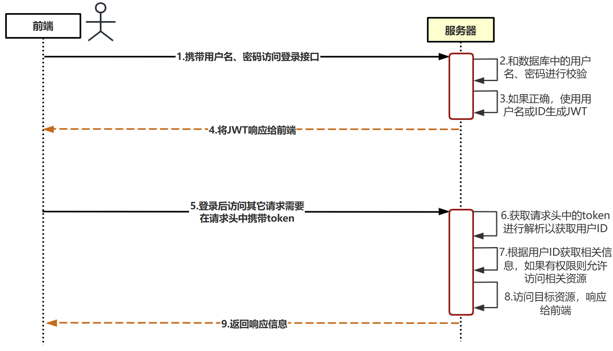
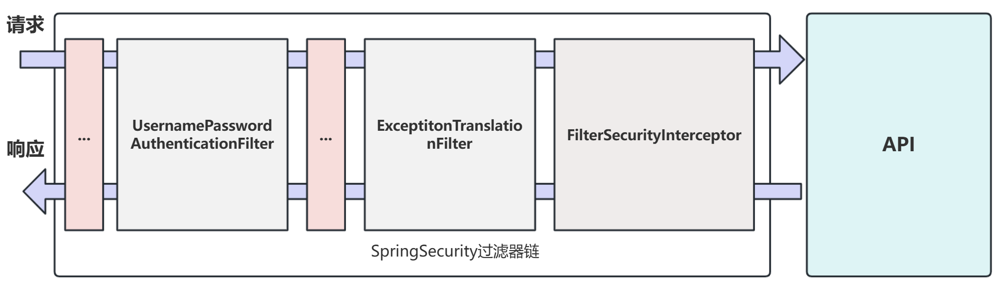
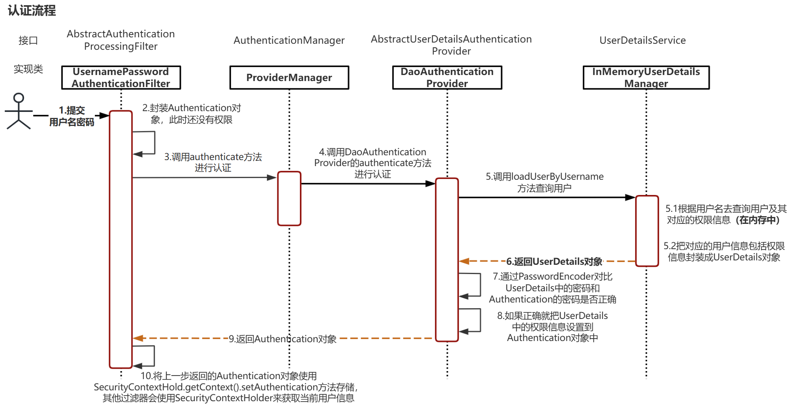
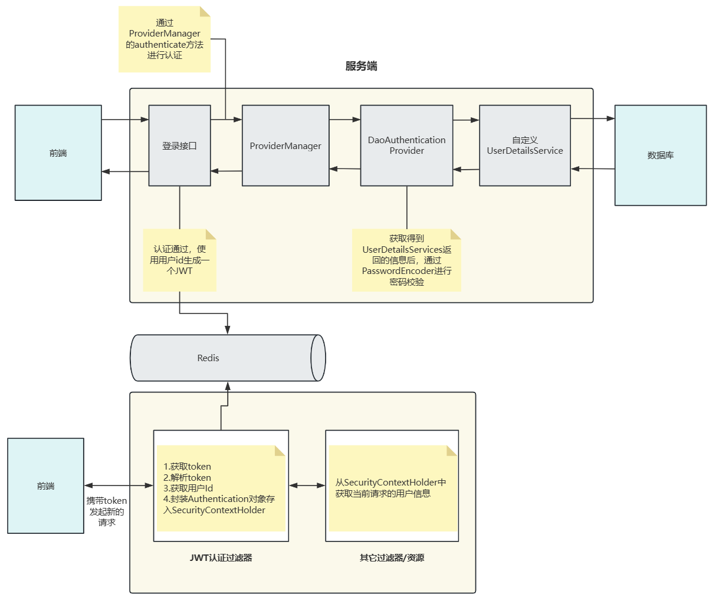

##  Spring

### Spring Security

#### 认证

##### 登录校验流程

 

##### Spring Security完整流程

Spring Security的原理实际上就是一个过滤器链，内部包含了各种功能的过滤器：



其中包含三个核心过滤器：

**UsernamePasswordAuthenticationFilter：**负责处理在登录页面填写用户名及密码后的登录请求，主要负责认证工作。

**ExceptionTranslationFilter：**处理过滤器链中抛出的任何AccessDeniedException和AuthenticationException。

**FilterSecurityInterceptor：**负责权限校验的过滤器。

##### 认证流程详解



**Authentication接口：**实现类封装了当前访问系统用户的相关信息。

**AuthenticationManager接口：**定义了认证Authentication的方法。

**UserDetailsService接口：**加载用户特定数据的核心接口，里面定义了一个根据用户名查询用户信息的方法。

**UserDetails接口：**提供核心用户信息，将UserDetailsService获取的用户信息封装成UserDetails对象返回，然后将这些信息封装到Authentication对象中。

##### 具体实现

登录

- 自定义登录接口
  - 调用ProviderManger的方法进行认证，如果认证通过生成JWT
  - 把用户信息存入redis

- 自定义UserDetailsService
  - 在该实现类中查询数据库

校验

- 定义JWT认证过滤器
  - 获取token
  - 解析token中的用户ID
  - 从redis中获取用户信息
  - 存入SecurityContextHolder



### AOP

#### 核心概念

- Joinpoint（连接点）：连接点指的是可以被增强的点，在spring中指的是方法，spring中只支持方法类型的连接点。
- **Pointcut（切入点）：所谓切入点时指被增强的连接点。**
- **Advice（通知/增强）：所谓通知是指具体增强的代码。**
- Target（目标对象）：被增强的对象就是目标对象。
- **Aspect（切面）：是切入点和通知的结合**
- Proxy（代理）：一个类被AOP增强后，就产生一个结果代理类。

#### 切点表达式

**execution([修饰符] 返回值类型 包名.类名.方法名(参数))**

- 访问修饰符可以省略，大部分情况下都会省略
- 返回值类型、包名、类名、方法名可以使用*代表任意
- 包名与类名之间一个点代表当前包下的类，两个点代表当前包及其子包下的类
- 参数列表可以使用两个点表示任意个数，任意类型的参数列表

```java
//表示service包下任意类、任意方法、参数列表任意、返回值类型任意
execution(* com.timi.service.*.*(..));
//表示service包及其子包下任意类、任意方法、参数列表任意、返回值类型任意
execution(* com.timi.service..*.*(..));
//表示service包下任意类、方法不带参数、返回值类型任意
execution(* com.timi.service.*.*());
```

#### 切点函数@annotation

 在要增强的方法上加上注解，使用@annotation来表示对方法进行增强，相比于切点表达式更加灵活。

1. 首先定义注解

```java
@Target({ElementType.METHOD})//该注解可以加在方法上
@Retention(RetentionPolicy.RUNTIME)
public @interface InvokeLog{
}
```

2. 定义切面类

```java
@Component
@Aspect
public class MyAspect{
    //Pointcut 使用Pointcut注解中的属性来指定对哪些方法进行增强
    @Pointcut("annotation(com.timi.InvokeLog)")
    public void pt(){}
 	//Advice 用@Before注解来指定该方法中是增强的代码，并且是在被增强方法执行
    @Before("pt()")
    public void methodBefore(){
        //TODO
    	//process before pointcut
    }
}
```

3. 对需要增强的方法使用注解

```java
@InvokeLog
public void testAnnotation(){
    //process
}
```

#### 通知分类

- @Before：前置通知，在目标方法执行前执行
- @AfterReturning：返回后通知，在目标方法执行后执行，如果出现异常则不会执行
- @After：后置通知，在目标方法之后执行，无论是否出现异常都会执行
- @AfterThrowing：异常通知，在目标方法抛出异常后执行
- @Around：环绕通知，围绕着方法执行

其中@Around注解较为特殊，环绕通知的增强方法如下：

```java
@Around("pt()")
public void around(ProceedingJoinPoint pjp){
    System.out.println("执行在目标方法前，相当于@Befored的作用");
    try{
        pjp.proceed();//目标方法执行
        System.out.println("执行在目标方法后，相当于@AfterReturning的作用");
    }catch(Throwable throwable){
        throwable.printStackTrace();
        System.out.println("执行在抛出异常后，相当于@AfterThrowing的作用");
    }finally{
        System.out.println("执行在目标方法后，相当于@After的作用");
    }
}
```

#### 获取被增强方法相关信息

使用ProceedingJoinPoint获取方法的相关信息
